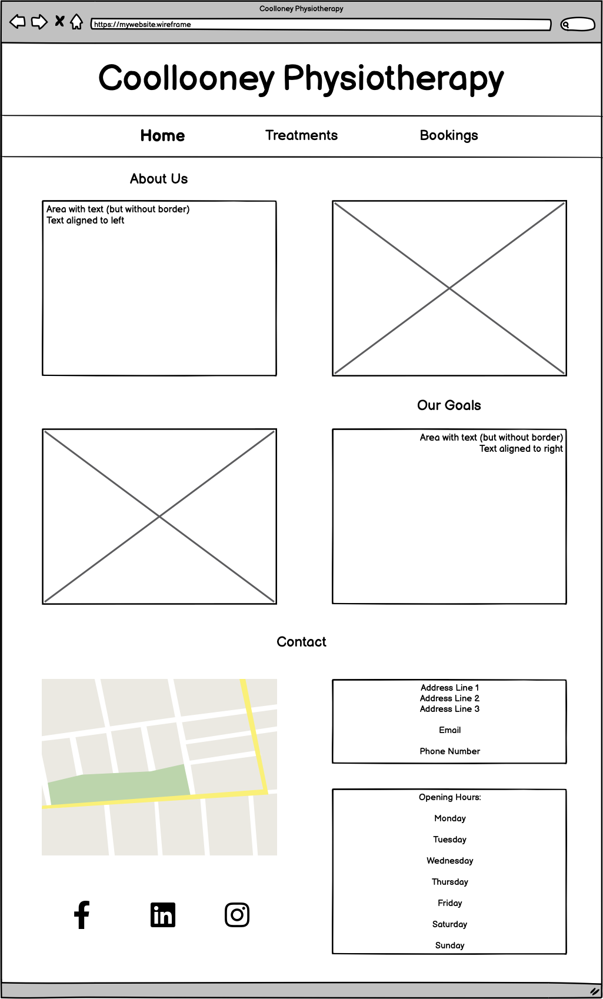
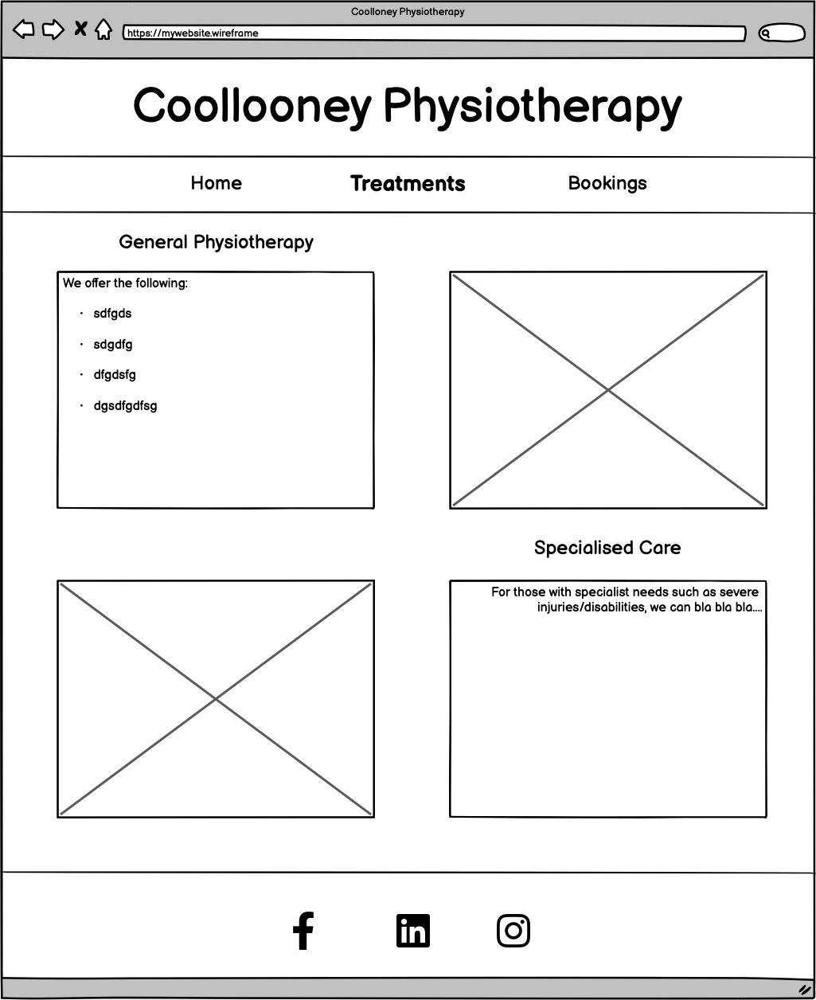
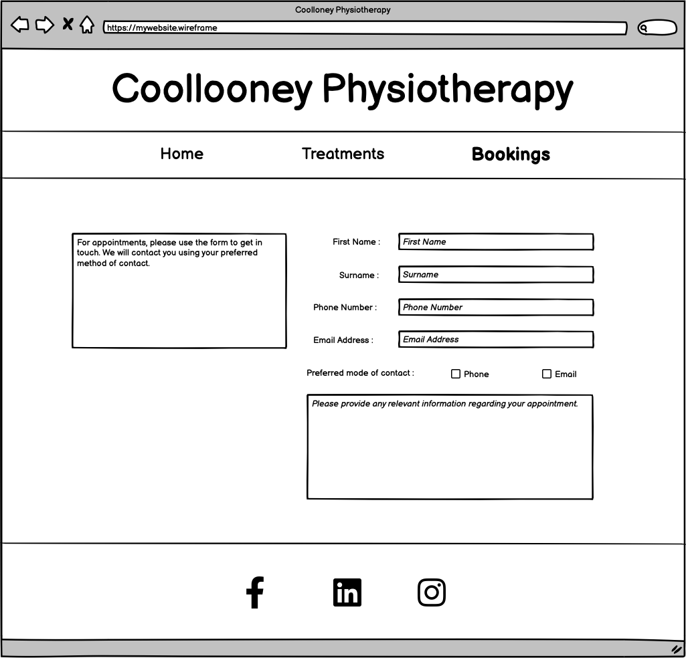
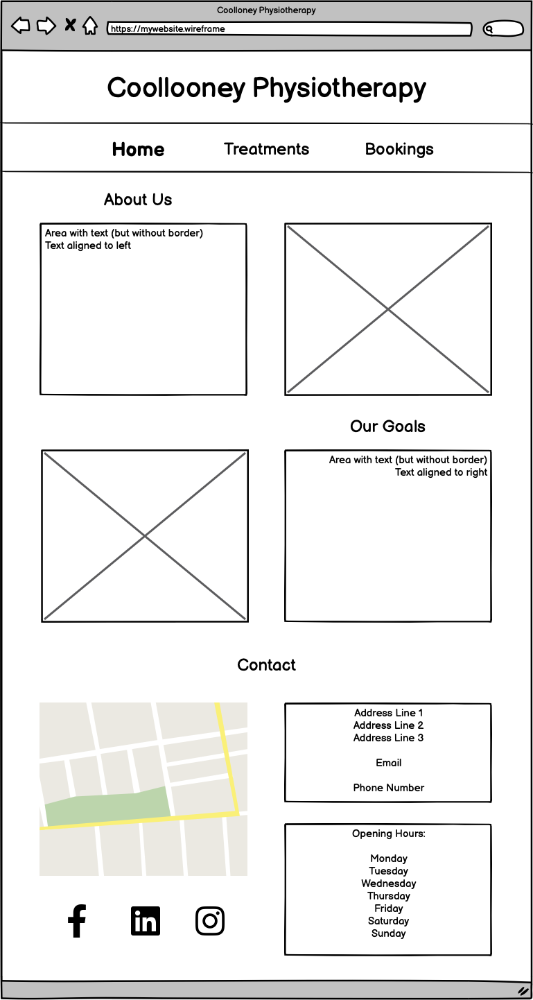
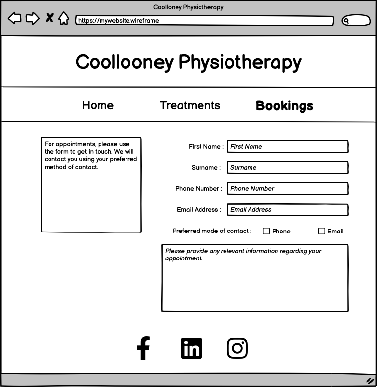
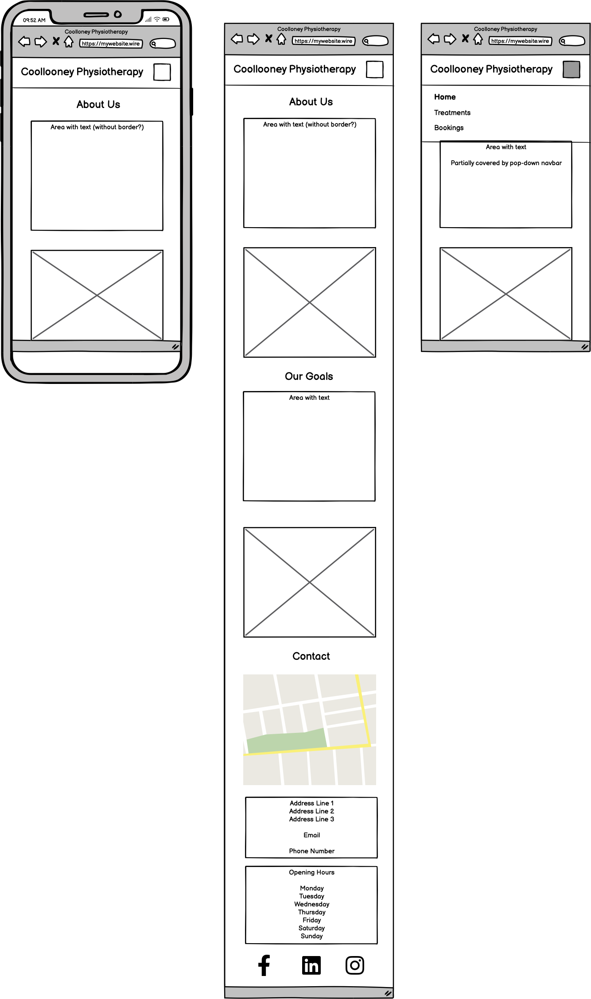
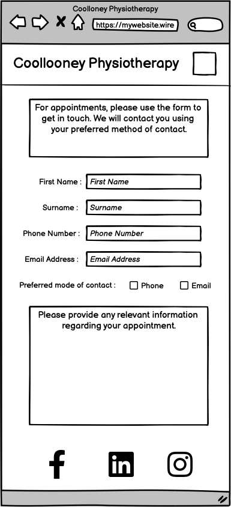

# Collooney Physiotherapy Website - PP1 <! -- omit in toc -->

This project is a website for a (currently) fictional physiotherapy clinic 
based in Collooney, Sligo.

[Deployed Website](https://diarmuidhenry.github.io/Project-01/)

## Table of Contents <! -- omit in toc -->

- [Collooney Physiotherapy Website - PP1 \<! -- omit in toc --\>](#collooney-physiotherapy-website---pp1-----omit-in-toc---)
  - [Table of Contents \<! -- omit in toc --\>](#table-of-contents-----omit-in-toc---)
  - [Aim](#aim)
    - [Website Objective](#website-objective)
    - [Key Features](#key-features)
  - [Potential Users](#potential-users)
    - [User Goals](#user-goals)
  - [Design \& Development](#design--development)
    - [5 Planes of UX](#5-planes-of-ux)
      - [Strategy](#strategy)
      - [Scope](#scope)
      - [Structure](#structure)
      - [Skeleton](#skeleton)
      - [Surface](#surface)
    - [Wireframes](#wireframes)
      - [Mobile](#mobile)
      - [Tablet](#tablet)
      - [Desktop](#desktop)
    - [Colour Scheme](#colour-scheme)
    - [Icons/Links/Navigation](#iconslinksnavigation)
    - [Page Layout](#page-layout)
  - [Technology \& Resources](#technology--resources)
  - [Deployment](#deployment)
  - [Issues/Bugs](#issuesbugs)
  - [Testing \& Validation](#testing--validation)
  - [Future Improvements/Development](#future-improvementsdevelopment)

---

## Aim

### Website Objective

To create a website advertising Collooney Physiotherapy to those searching the services of a physiotherapist in the surrounding area, thereby increasing the number of clients.
The website should clearly show the services provided, as well as giving the user a positive experience whilst on the website. This would be achieved by an intuiative layout, images positive images and a soft, comfortable colour palette.

### Key Features

The website will include a homepage briefly covering what the clinic does and aims to achieve with their services. There will also be a page showing treatments provided, as well as links to exerciese people can do themselves at home. Finally, there will be a bookings page, where potential clients can contact the clinic about making a booking by providing a date, time, their contact details, as well as any information prevelant to their booking.

---

## Potential Users

The website would be of interest to anyone living in the area seeking treatment from a physhiothrapist.

### User Goals

To either make an appointment/enquiry with the clinic, or at least learn more about them so that they can
then decide if they would liee to go ahead and seek treatment.

---

## Design & Development

### 5 Planes of UX
#### Strategy
- Users in the geographical are  need a physiotherapist but don't know where to find one. The clinic itself wants to get more clients to increase business.
  
#### Scope
- Include a homepage wtogive an overall impresiosn onf the page. Includsome of the treatments available ad have a way that thae users can make a booking, o enquire about a booing.
  
#### Structure
- 3 pages: Home, Treatments and Bookings. Users can easilyad cleal navigate between these fro a navbar (or dropdown menu on mobile deviees)
  
#### Skeleton
- A hero image greets the user when they first link to the site. A clear navbar at the top links to the 3 pages, whilst making clear which page the user is on. The pages contain a mixture of text and complementary images to give users visual guidance to what they can expect if they choose to become a client.
  
See [Wireframes](#wireframes) below.

#### Surface
- A soft, professional pastel [colour scheme](#colour-scheme) to represent calmness and professionalism. Intuitive UI with clear links, explanatory text and all basic information.

### Wireframes

#### Desktop

#### Tablet

#### Mobile

### Colour Scheme

### Icons/Links/Navigation

### Page Layout
**Home**
**Treatments**
**Bookings**

---

## Technology & Resources
- **IDE :** CodeAnywhere
- **Languages :** HTML and CSS, with Markdown being used for this readme.
- **Template :** The [CodeInstitute template](https://github.com/Code-Institute-Org/ci-full-template) was used in order to install all the relevant tools for the code to function.
- **GitHub** was used to host the project. I used `git commit` regularly to create versions of the project at regular intervals. This meant that I could be more precise if I needed to `git reset`.
- **Balsamiq** was used to create wireframes for mobile, table and desktop.
- **Pexel** was used to find royalty-free images that I could safely use without worry of copyright infringement.
- [**Markdown Guide**](https://www.markdownguide.org/cheat-sheet/) was used to help create the readme.
- [**Contrast Finder**](https://app.contrast-finder.org/) and [**Coolors**](https://coolors.co/) were used to help find a colour scheme with an acceptable contrast.
- [**Favicon.io**](https://favicon.io/favicon-generator/) was used to create a

---

## Deployment

---

## Issues/Bugs

---

## Testing & Validation

---

## Future Improvements/Development
