# Collooney Physiotherapy Website - PP1<!-- omit from toc -->

This project is a website for a physiotherapy clinic based in Collooney, Co. Sligo.

They provide a quality service and pride themselves in being industry leaders. They therefore want a professional website that suits their branding and their ethos. Since they are located in a region with lower population density, they want somewhere that people can discover not only information about their services, but also connect with them through social media, thereby increasing their potential client pool.

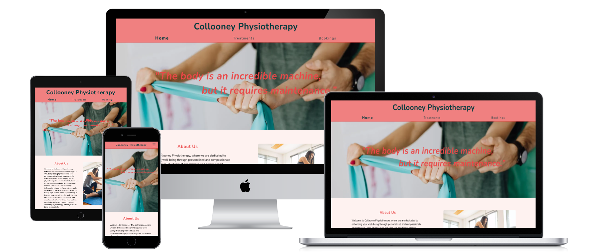

[Deployed Website](https://diarmuidhenry.github.io/Project-01/)

## Table of Contents<!-- omit from toc -->

- [Aim](#aim)
  - [Website Objective](#website-objective)
  - [Key Features](#key-features)
- [Potential Users](#potential-users)
  - [User Goals](#user-goals)
  - [User Testimonials](#user-testimonials)
- [Design \& Development](#design--development)
  - [5 Planes of UX](#5-planes-of-ux)
    - [Strategy](#strategy)
    - [Scope](#scope)
    - [Structure](#structure)
    - [Skeleton](#skeleton)
    - [Surface](#surface)
  - [Wireframes](#wireframes)
    - [Desktop](#desktop)
    - [Tablet](#tablet)
    - [Mobile](#mobile)
  - [Colour Scheme](#colour-scheme)
  - [Icons/Links/Navigation](#iconslinksnavigation)
  - [Pages \& Features](#pages--features)
- [Technology \& Resources](#technology--resources)
- [Deployment](#deployment)
- [Issues/Bugs](#issuesbugs)
  - [Resolved](#resolved)
  - [Unresolved](#unresolved)
- [Testing \& Validation](#testing--validation)
  - [Functional Testing of Website](#functional-testing-of-website)
    - [Header \& Navbar - Mobile](#header--navbar---mobile)
    - [Header \& Navbar - Tablet \& Desktop](#header--navbar---tablet--desktop)
    - [Footer](#footer)
    - [Homepage](#home-page)
    - [Bookings Page](#bookings-page)
    - [Treatments Page](#treatments-page)
  - [PageSpeed Insights Tests](#pagespeed-insights-tests)
    - [Homepage](#homepage-pagespeed)
    - [Bookings Page](#bookings-pagespeed)
    - [Treatments Page](#treatments-pagespeed)  
  - [HTML Code Validation](#html-code-validation)
    - [Homepage](#homepage-validation)
    - [Bookings](#bookings-validation)
    - [Treatments](#treatments-validation)
  - [CSS Code Validation](#css-validation)
- [Future Improvements/Development](#future-improvementsdevelopment)

## Aim

### Website Objective

To create a website advertising Collooney Physiotherapy to those searching the services of a physiotherapist in the surrounding area, thereby increasing the number of clients.
The website should clearly show the services provided, as well as giving the user a positive experience whilst on the website. This would be achieved by an intuitive layout, positive images and a soft, comfortable colour palette.

### Key Features

The website will include a *Home* page briefly covering what the clinic does and aims to achieve with their services. There will also be a page showing *Treatments* provided, as well as links to exercises people can do themselves at home. Finally, there will be a *Bookings* page, where potential clients can contact the clinic about making a booking by providing a date, time, their contact details, as well as any information relevant to their booking.

## Potential Users

The website would be of interest to anyone living in the area seeking treatment from a physhiotherapist, as well as family/friends thereof.

### User Goals

To either make an appointment/enquiry with the clinic, or at least learn more about them so that they can then decide if they would like to go ahead and seek treatment.

### User Testimonial

John, aged 34, lives in Ballisodare, Co. Sligo, just a few kilometres from Collooney. He has injured his shoulder playing football at the weekend, which was then exacerbated by his physical day job as a plasterer. He would like to get professional help, but thinks that a visit to his GP isn't the right approach.

John searched online and found the website for Collooney Physiotherapy. He was initially impressed by the sleek, simple design, giving him a good first impression. He had a look at the clinic's social media pages and was impressed by the range of services that he saw patients receiving. He looked through some of the exercises they recommended that he could perform at home, and figured he'd see if they helped.

2 days later, and John is already feeling better, but there was still a lot of pain and discomfort. He revisited the website and quickly navigated to the *Bookings* form, where he made an appointment for next Thursday at 11.30, remembering to explain his condition in the *Message* field. Around 15 minutes later, when the clinic had received and read his submission, they rang him on his mobile (which was his preferred method of contact), letting him know what they have booked him in for the appointment at 11.30 next Thursday. This also gave them a few minutes to chat about his condition, break the ice, and to make John feel welcome before he even arrived.

John has now been to the clinic 3/4 times and his physical condition has greatly improved. He has also recommended Collooney Physiotherapy to some of his coworkers that are also suffering from muscular pain.

## Design \& Development

### 5 Planes of UX

#### Strategy

- Users in the geographical area need a physiotherapist, but don't know where to find one. The clinic itself wants to get more clients to increase business.
  
#### Scope

- Include a *Home* page that gives an overall positive impression of the page. Include some of the therapies available and have a way that thae users can make a booking, or enquire about a booking.
  
#### Structure

- 3 pages: *Home*, *Treatments* and *Bookings*. Users can easily and clearly navigate between these from a navbar (or drop-down menu on mobile devices).
  
#### Skeleton

- A hero image greets the user when they first link to the site. A clear navbar at the top links to the 3 pages, whilst making it apparent/obvious which page the user is on. The pages contain a mixture of text and complementary images to give users visual guidance to what they can expect if they choose to become a client.
  
See [Wireframes](#wireframes) below.

#### Surface
- A soft, professional pastel [colour scheme](#colour-scheme) to represent calmness and professionalism. Intuitive UI with clear links, explanatory text and all necessary basic information.

### Wireframes

#### Desktop

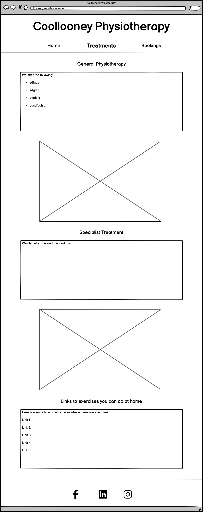

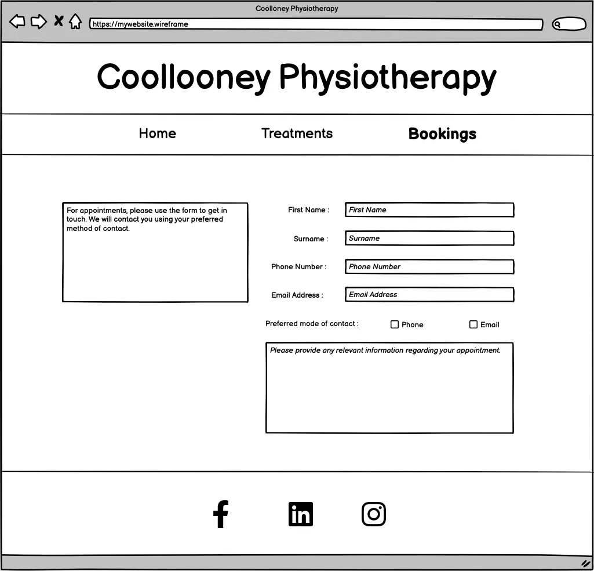

#### Tablet

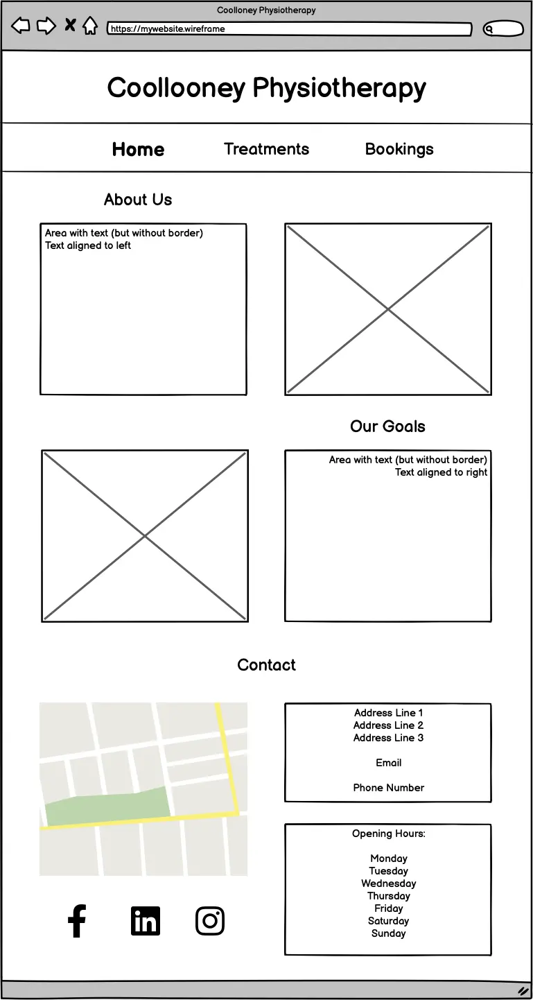

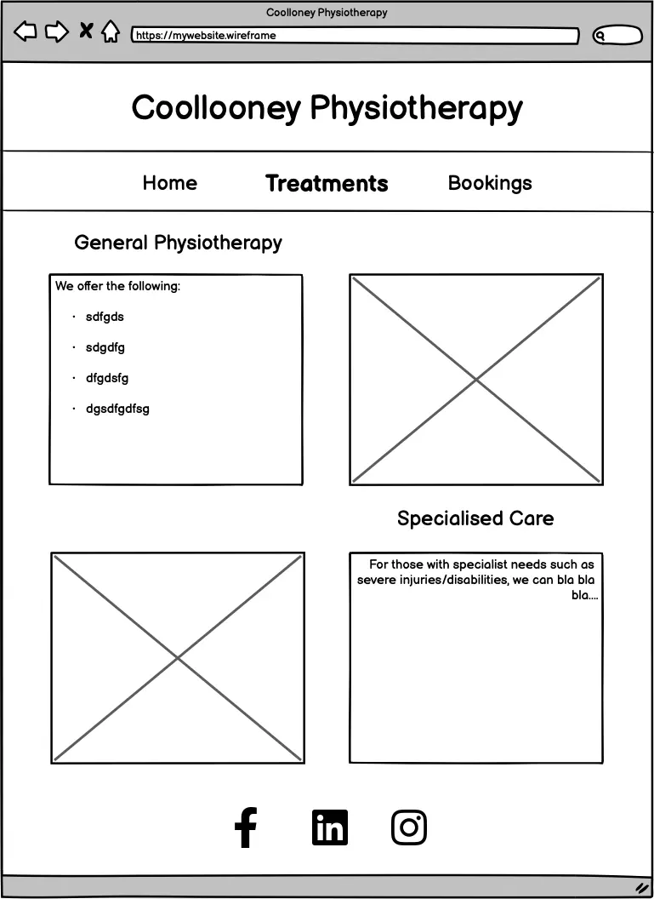

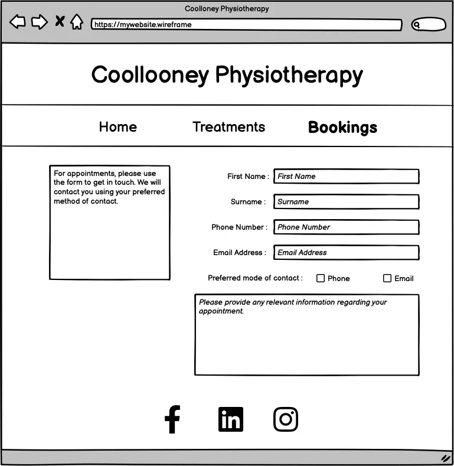

#### Mobile

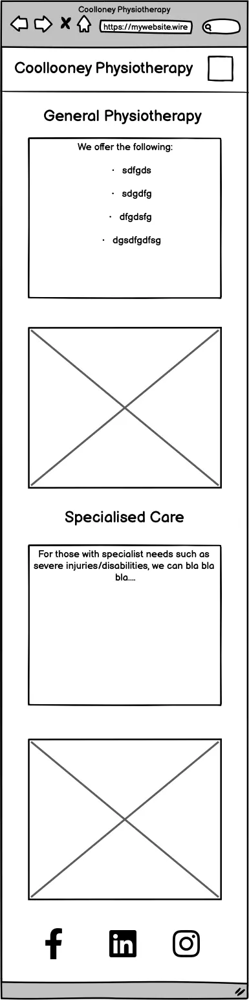

### Colour Scheme
The colour scheme changed after the deployment due to [accessibility issues](#issuesbugs). The initial colour scheme included light pastel tones to give the user a feeling of calmness and professionalism; a clean experience without being cold and unwelcoming.

However, whilst testing using [WAVE](#technology--resources), it revealed a low contrast between the header background colour and the font colour.

After experimenting with different font colours, it became apparent that the best option was to choose a darker text colour. For this reason, I settled on the following colour scheme.

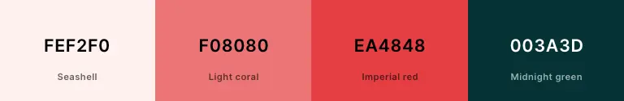

Although this wasn't the original plan, it still looks and feels clean, professional and warm, thereby fulfilling the original criteria.

### Icons/Links/Navigation

Icons with links to social media were done with colours contrasting to the background to make them stand out.
Links to other pages on the website are underlined when you hover over with a mouse, and are in bold when that is the current page, to emphasise that it is the current location.
Links (in text) to external websites are done in bold, and are underlined when you hover over them. I also avoided single word hyperlinks to make them more obvious and thereby approve accessibility.

### Pages \& Features
**Home**

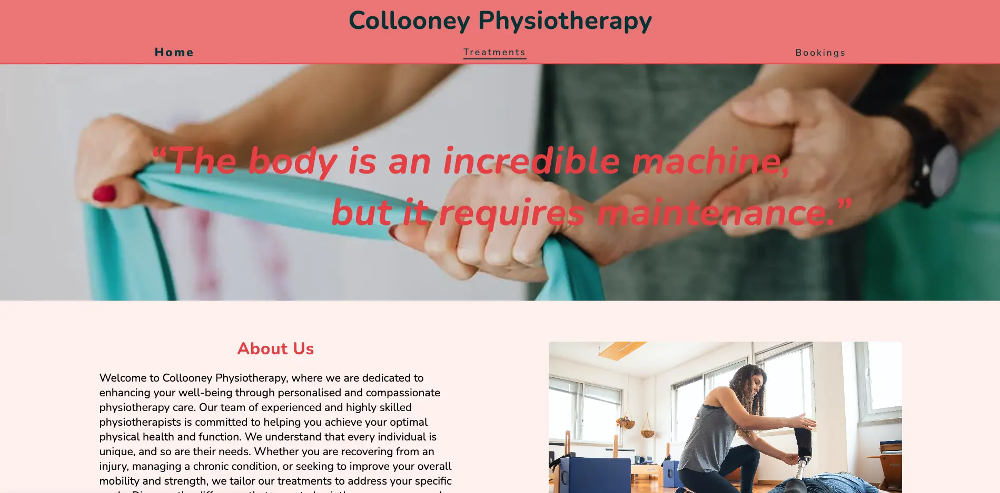

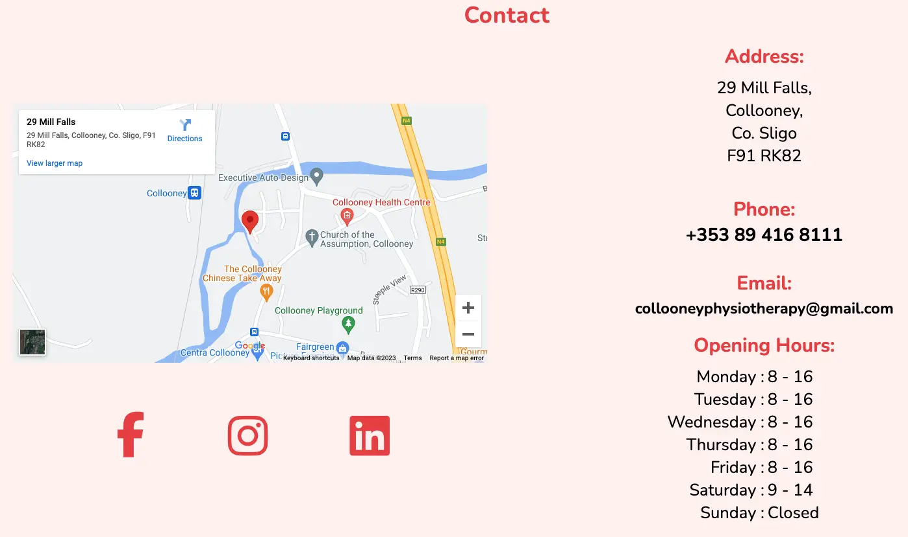

As originally planned, the *Home* page looks clean, professional, warm and welcoming, with a good mix of high quality pictures and well formatted text. The header allows for easy navigation, and the contact information allows for the user to learn about the clinic's location, as well as to see it's social media pages.

**Treatments**

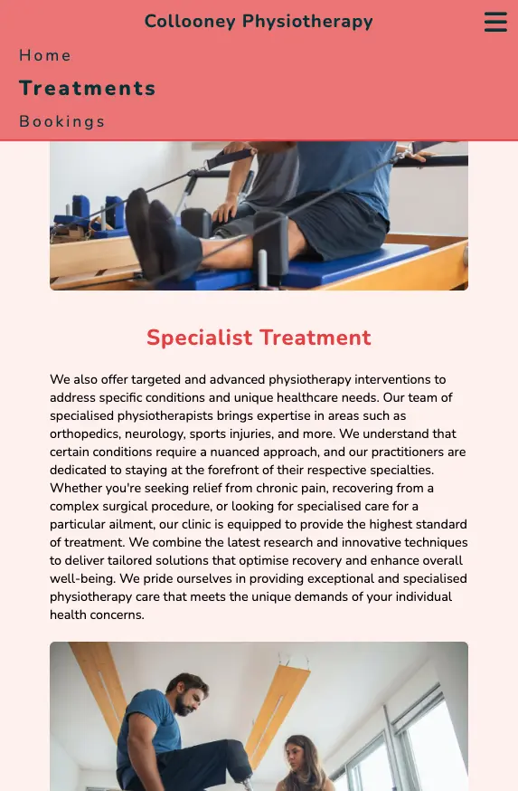

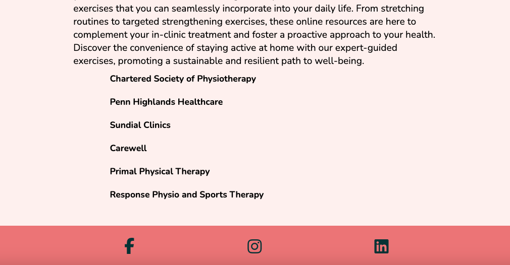

The user can see and read about the variety of services that the clinic offers. As well as this, links are provided to external sites with exercises clients can perform at home. The intention of this is not only to allow them to see/feel the results of physiotherapy exercises, but also so that they feel that the clinic has already begun to help them before they have even stepped foot inside.

Here you can also see the functionality of the drop-down menu for mobile devices, clearly indicating your current location on the site.

**Bookings**

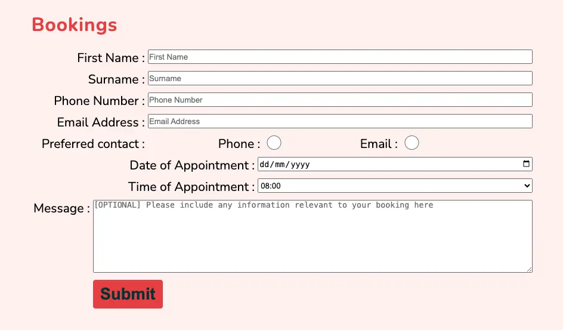

The bookins form allows users (regulars and first-timers) to easily book an appointment. The clinic will be sent this information and can then quickly get in touch with the user in the preferred method that they have selected.

## Technology \& Resources
- **IDE :** [CodeAnywhere](https://app.codeanywhere.com/)
- **Languages :** HTML and CSS, with Markdown being used for this readme.
- **Template :** The [CodeInstitute template](https://github.com/Code-Institute-Org/ci-full-template) was used in order to install all the relevant tools for the code to function.
- [**Github**](https://github.com/) was used to host the project. I used `git commit` regularly to create versions of the project at regular intervals. This meant that I could be more precise if I needed to `git reset`.
- [**Balsamiq**](https://balsamiq.com/) was used to create wireframes for mobile, table and desktop.
- [**Pexels**](https://www.pexels.com/) was used to find royalty-free images that I could safely use without worry of copyright infringement.
- [**Markdown Guide**](https://www.markdownguide.org/cheat-sheet/) was used to help create the readme.
- [**Contrast Finder**](https://app.contrast-finder.org/) and [**Coolors**](https://coolors.co/) were used to help find a colour scheme with an acceptable contrast.
- [**Favicon.io**](https://favicon.io/favicon-generator/) was used to create a custom favicon.
- [**WAVE**](https://wave.webaim.org/) and [**PageSpeed Insights**](https://pagespeed.web.dev/) testing tools were used to locate minor issues and check both accessibility and performance. 
- [**ChatGPT**](https://chat.openai.com/) was used to help fill in the blocks of text. Note: *no code was written/created using ChatGPT*.
- [**Website Mockup Generator**](https://websitemockupgenerator.com/) to make the screen mockups seen at the top of the readme.

## Deployment

Once the basic design of the website was finished, I deployed it to GitHub Pages. [The history of all deployed version of the site can be found here](https://github.com/DiarmuidHenry/Project-01/deployments).

### How to Deploy to GitHub Pages

1. Log in to github.com.
2. Select *Project-01* in my list of repositories.
3. Click Settings > Pages.
4. Under *Source*, select *Deploy from a branch*.
5. Under *Branch*, select *main* and */root*, then click *Save*.
6. Wait a couple of minutes for the site to deploy, then navigate back to the repository.
7. Click *Deployments*, which now should have appeared on the main repository page.
8. Under *Active Deployments*, click the link https://diarmuidhenry.github.io/Project-01/. (The deployed page will open in the current tab).

### How to Clone Repository

1. Go to the [GitHub repository](https://github.com/DiarmuidHenry/Project-01/).
2. Click the green *Code* drop-wdwn button.
3. Click *HTTPS* and copy the URL.
4. Open your IDE, and open a terminal.
5. Type `git clone url`, replacing `url` with the URL copied in step 3.

## Issues/Bugs

### Resolved

Apart from the usual spelling mistakes/typos, forgotten brackets/line breaks, there were a few issues that I encountered once the site was deployed: 

- One of these was with the lack of colour contrast, which was mentioned above in the [Colour Scheme](#colour-scheme) section.
  
- Invalid inputs were being accepted by the form, e.g. entering letters in the *Phone Number* field was allowed, entering numbers in the *First Name* field was allowed.

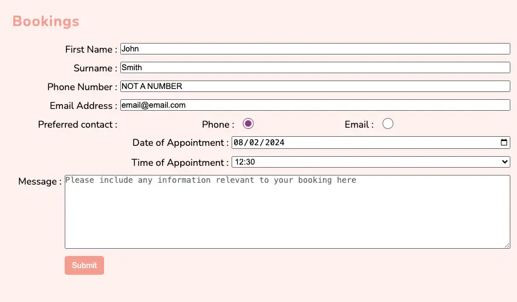

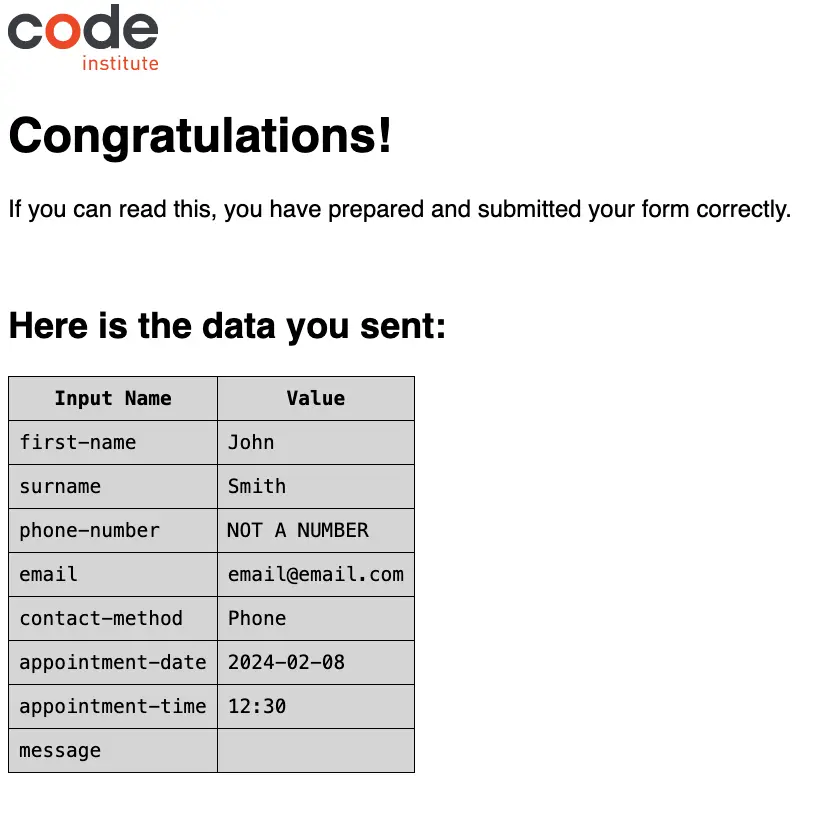

The fix to this was simply to restrict the input pattern for the relevant fields to the correct type/format. Now, only inputs of the correct form are accepted.

- The image under *Rehabilitation* on the *Treatments* page was slightly blurry/pixelated on larger screens.

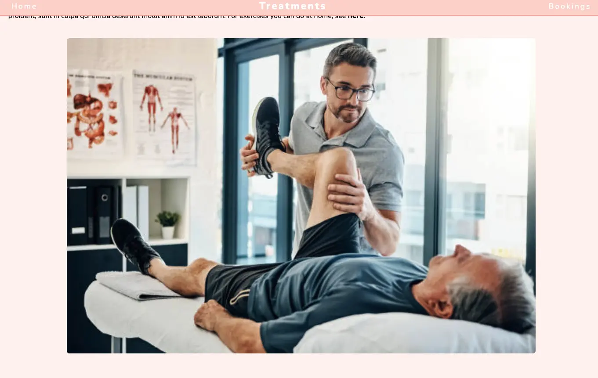

This was fixed by replacing it with another picture that was sufficiently large.

- The language inside the map embedded in the iframe on the *Home* page was in Danish. This was due to the fact that the language of the computer that I was using was Danish. 

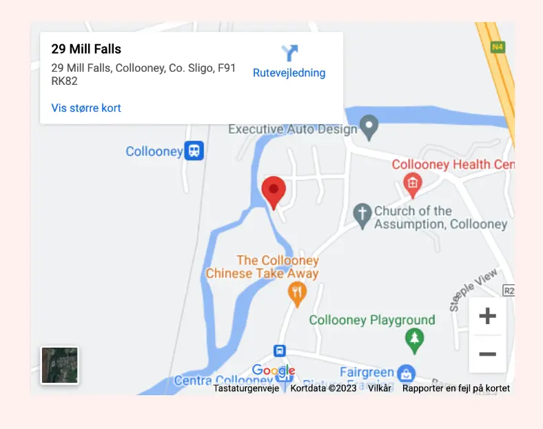
  
After a quick Google search, I found out which letters in the `src` property of the iframe were responsible for language. I simply changed `da` to `en` and it solved the issue.

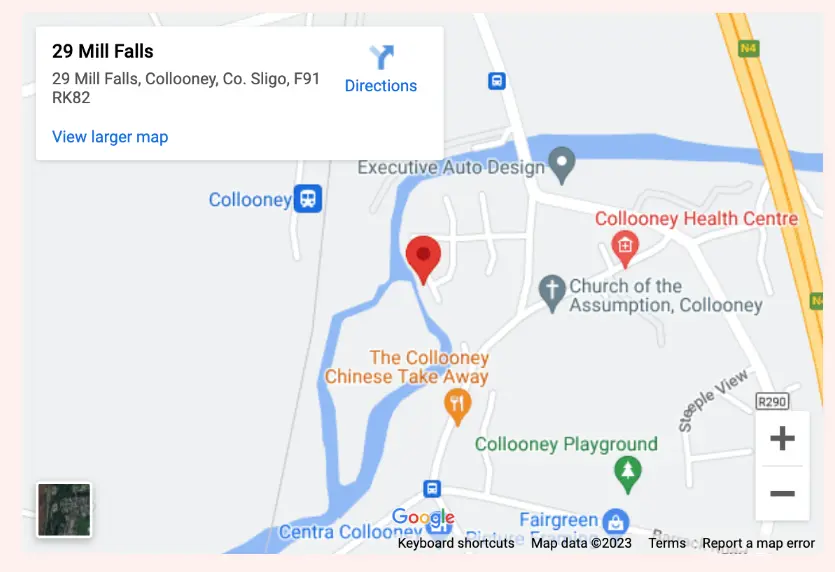

- When using [PageSpeed Insights](#technology--resources) to check the speed of each HTML page, I saw that two of the image files I had used were very large, causing the *Home* page to load slowly.

I found a free online tool to decrease the size of the image and replaced the original with the smaller one. This drastically decreased the loading time.

### Unresolved

- When using [PageSpeed Insights](#technology--resources) to check the speed of each HTML page on Mobile devices, there are several things that are causing delays, including those shown below:

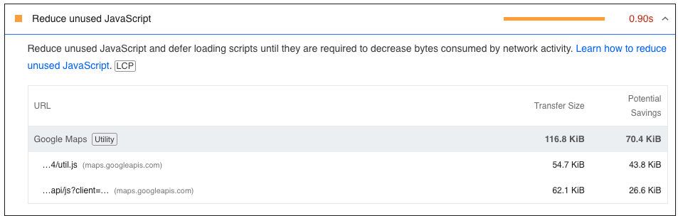

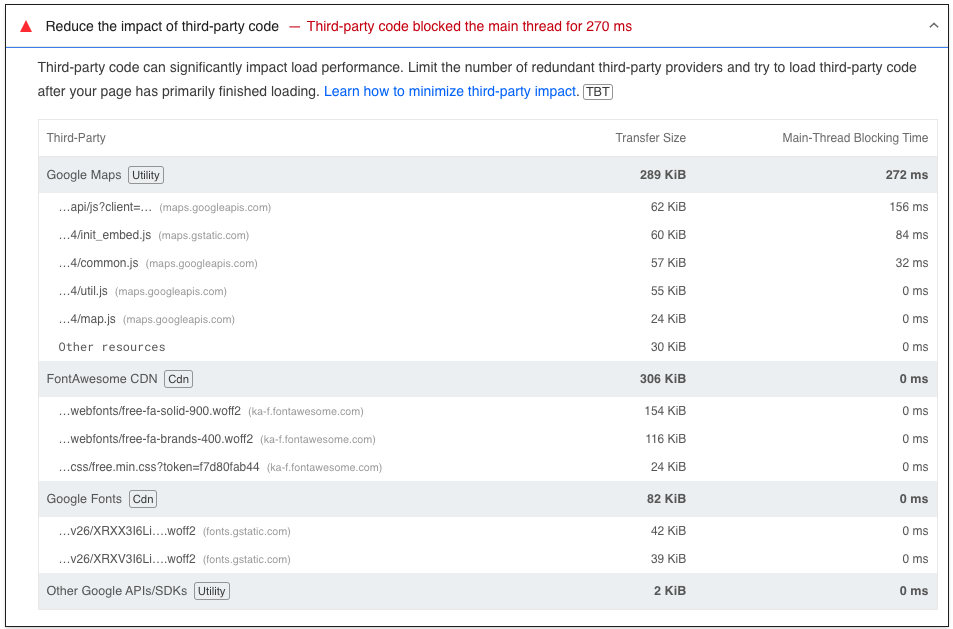

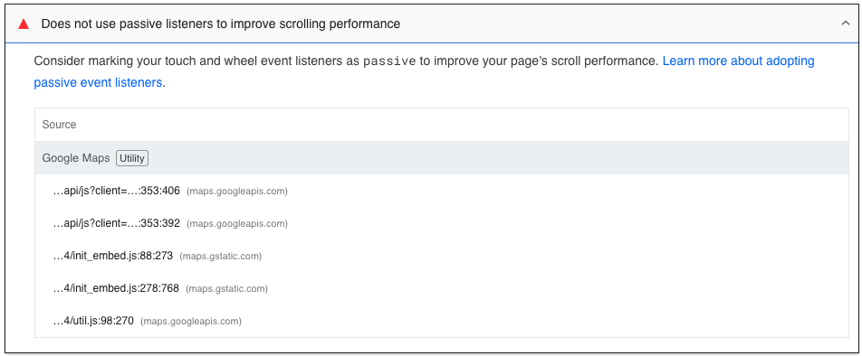

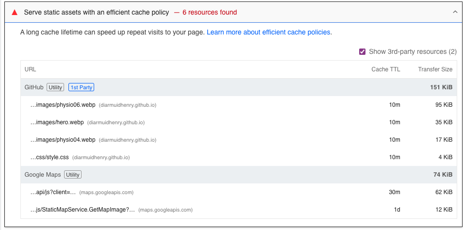

Since these have not been included in the HTML and/or CSS modules, I have no knowledge of how to improve or eliminate these issues. This can be addressed in the future.

## Testing \& Validation

### Functional Testing of Website

#### Header \& Navbar - Mobile

|Test Item|Test Carried Out|Result|Pass/Fail|
|-------------|------------------|-----------|-------|
|Hamburger icon|Clicked on icon|The drop-down menu appeared, showing *Home*, *Treatments* and *Bookings*|PASS|
|*Home* link in navbar|Click on *Home*|*Home* page loads|PASS|
|*Treatments* link in navbar|Click on *Treatments*|*Treatments* page loads|PASS|
|*Bookings* link in navbar|Click on *Bookings*|*Bookings* page loads|PASS|
|Current page location appears in bold|Reveal drop-down menu whilst on *Home*, *Treatments* and *Bookings*|Current location is shown in bold|PASS|

#### Header \& Navbar - Tablet \& Desktop

|Test Item|Test Carried Out|Result|Pass/Fail|
|-------------|------------------|-----------|-------|
|*Home* link in navbar|Hover over, then click on *Home*|*Home* is underlined when hovered over. When clicked, *Home* page loads|PASS|
|*Treatments* link in navbar|Hover over, then click on *Treatments*|*Treatments* is underlined when hovered over. When clicked, *Treatments* page loads|PASS|
|*Bookings* link in navbar|Hover over, then click on *Home*|*Bookings* is underlined when hovered over. When clicked, *Bookings* page loads|PASS|
|Current page location appears in bold|N/A|Current location is shown in bold|PASS|

#### Footer

|Test Item|Test Carried Out|Result|Pass/Fail|
|-------------|------------------|-----------|-------|
|Facebook icon|Click on Facebook icon|Opens Facebook's homepage in a new tab|PASS|
|Instagram icon|Click on Instagram icon|Opens Instagram's homepage in a new tab|PASS|
|LinkedIn icon|Click on LinkedIn icon|Opens LinkedIn's homepage in a new tab|PASS|

#### Home Page

|Test Item|Test Carried Out|Result|Pass/Fail|
|-------------|------------------|-----------|-------|
|Embedded Google Map|Click on map, drag around, zoom in, click on 'View larger map' and 'Directions' links|All interactions and links worked as expected|PASS|
|Email Address link|Click on email address|Email app opened and opened a new email addressed to collooneyphysiotherapy@gmail.com|PASS|
|Phone link|Click on phone number|Phone number was copied to keypad, 1 click away from calling the correct number. On Desktop, the default phone app e.g. WhatsApp, Skype opened up and was awaiting confirmation to call the correct number|PASS|
|Facebook icon|Click on Facebook icon|Opens Facebook's homepage in a new tab|PASS|
|Instagram icon|Click on Instagram icon|Opens Instagram's homepage in a new tab|PASS|
|LinkedIn icon|Click on LinkedIn icon|Opens LinkedIn's homepage in a new tab|PASS|

#### Treatments Page

|Test Item|Test Carried Out|Result|Pass/Fail|
|-------------|------------------|-----------|-------|
|*Exercises at Home* links|Click on each link|Each link opens the correct corresponding website in a new tab|PASS|

#### Bookings Page

|Test Item|Test Carried Out|Result|Pass/Fail|
|-------------|------------------|-----------|-------|
|Booking form fields|Inputs of varying types (alphabetical; numerical; alphanumerical; blank;) were tried in all input forms.|Only valid inputs in the correct form were accepted|PASS|
|Submit button|Pressed submit both with invalid and valid inputs in the above fields|When invalid inputs were entered, the form would not submit, and a notifcation came up alerting the user to where there was an error. When all inputs were valid, form was submitted and the CodeInstitute dump form opened in a new tab, showing the correctly labelled information|PASS|

### PageSpeed Insights Tests

#### Homepage PageSpeed

- [Homepage](https://pagespeed.web.dev/analysis/https-diarmuidhenry-github-io-Project-01-index-html/cdhe9rsi5e?form_factor=desktop)

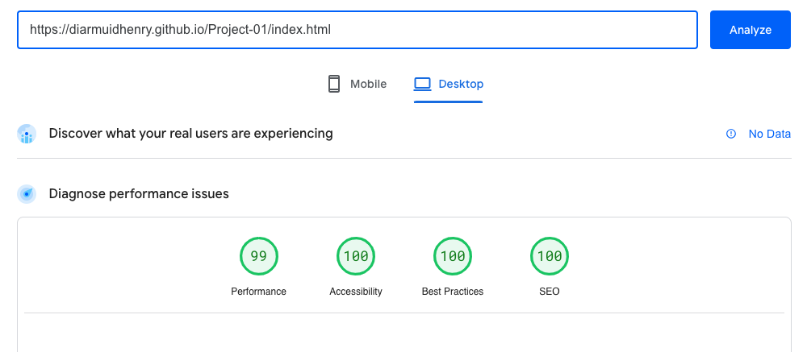

#### Treatments PageSpeed

- [Treatments](https://pagespeed.web.dev/analysis/https-diarmuidhenry-github-io-Project-01-treatments-html/8ntp5kvtjo?form_factor=desktop)

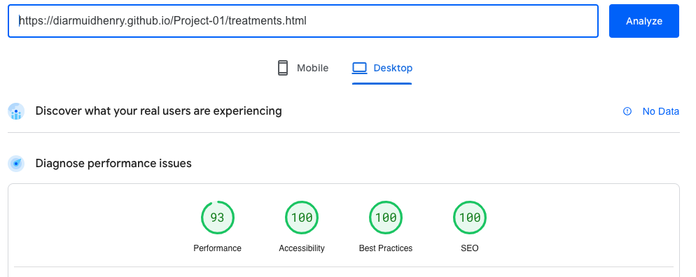

#### Bookings PageSpeed 

- [Bookings](https://pagespeed.web.dev/analysis/https-diarmuidhenry-github-io-Project-01-bookings-html/nz7g9lg2ci?form_factor=desktop)

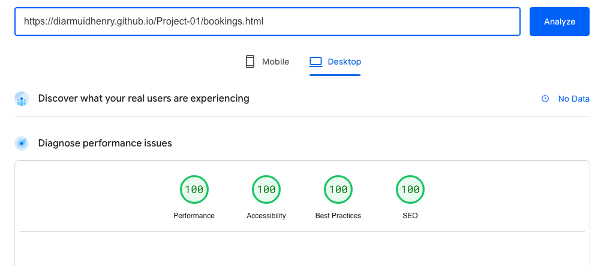

All pages performed very well, scoring 100 for *Accessibility*, *Best Practices* and *SEO*. While each page scored 93+ for *Performance* on Desktop, some of the pages scored as low as 85 on Mobile. However, after trying out those pages on several mobile devices, I was happy that this did not result in any sort of delays or negative results in user experience.

### HTML Code Validation

No errors were found in any of the HTML files.

#### Homepage Validation

- [Home](https://validator.w3.org/nu/?doc=https%3A%2F%2Fdiarmuidhenry.github.io%2FProject-01%2Findex.html)

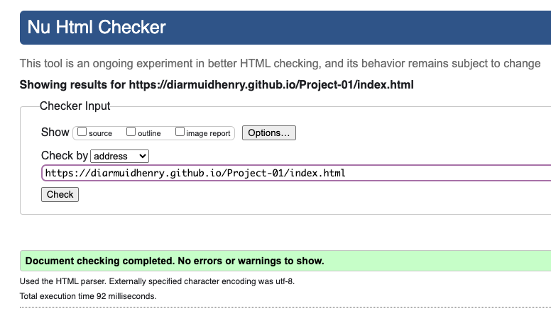

#### Treatments Validation

- [Treatments](https://validator.w3.org/nu/?doc=https%3A%2F%2Fdiarmuidhenry.github.io%2FProject-01%2Ftreatments.html)

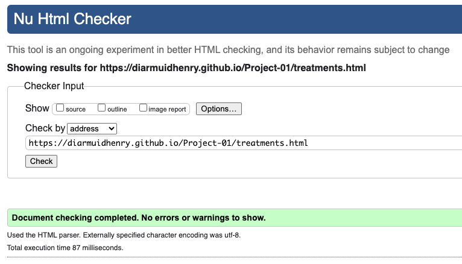

#### Bookings Validation

- [Bookings](https://validator.w3.org/nu/?doc=https%3A%2F%2Fdiarmuidhenry.github.io%2FProject-01%2Fbookings.html)

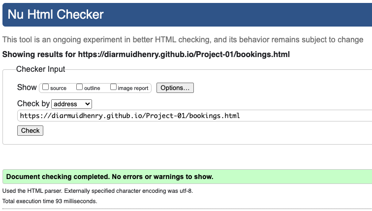

### CSS Validation

No errors were found in the `style.css` file.

- [style.css](https://jigsaw.w3.org/css-validator/validator?uri=https%3A%2F%2Fdiarmuidhenry.github.io%2FProject-01%2F&profile=css3svg&usermedium=all&warning=1&vextwarning=&lang=en)

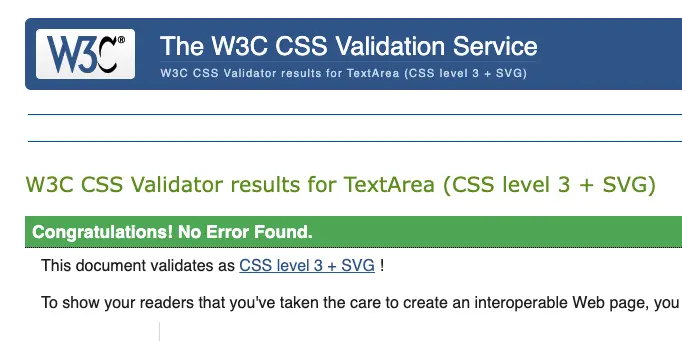

## Future Improvements/Development

- Sort out the performance issues on [PageSpeed Insights](#technology--resources) to improve the loading time on mobile devices to get a score of 90+.
- Improve the variety of images to show a broader range of services to potential clients.
- Create an extra page with a virtual tour of the clinic, given by some of the staff.
- Use javascript to limit which days and times can be chosen in the calendar on the Bookings form.

## Acknowledgements

- Luke Buchanan: my mentor, for giving clear, constructive feedback during the entire process.
- The Slack community, for the plethora of questions that have been previously asked and answered.
- Tutor Assistance, for helping solve the problems that I just couldn't get my head around.
- My partner Christina, for giving me the idea for the website.