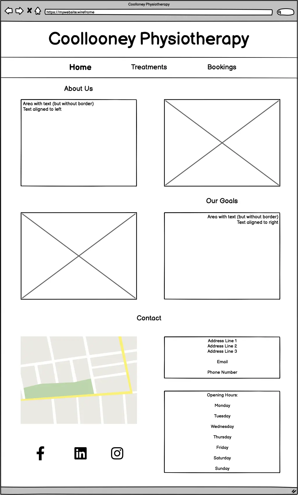

# Collooney Physiotherapy Website - PP1<!-- omit from toc -->

This project is a website for a physiotherapy clinic based in Collooney, Sligo.

They provide a quality service and pride themselves in being industry leaders. They therefore want a professional website that suits their branding and their ethos. Since they are located in a region with lower population density, they want somewhere that people can discover not only information about their services, but also connect with them through social media, thereby increasing their potential client pool.

[Deployed Website](https://diarmuidhenry.github.io/Project-01/)

## Table of Contents<!-- omit from toc -->

- [Aim](#aim)
  - [Website Objective](#website-objective)
  - [Key Features](#key-features)
- [Potential Users](#potential-users)
  - [User Goals](#user-goals)
  - [User Testimonials](#user-testimonials)
- [Design \& Development](#design--development)
  - [5 Planes of UX](#5-planes-of-ux)
    - [Strategy](#strategy)
    - [Scope](#scope)
    - [Structure](#structure)
    - [Skeleton](#skeleton)
    - [Surface](#surface)
  - [Wireframes](#wireframes)
    - [Desktop](#desktop)
    - [Tablet](#tablet)
    - [Mobile](#mobile)
  - [Colour Scheme](#colour-scheme)
  - [Icons/Links/Navigation](#iconslinksnavigation)
  - [Pages /\& Features](#pages--features)
- [Technology \& Resources](#technology--resources)
- [Deployment](#deployment)
- [Issues/Bugs](#issuesbugs)
  - [Resolved](#resolved)
  - [Unreseolved](#unreseolved)
- [Since these have not been included in the HTML and/or CSS modules, I have no knowledge of how to improve or elmminate these issues. This can be addressed in the future.](#since-these-have-not-been-included-in-the-html-andor-css-modules-i-have-no-knowledge-of-how-to-improve-or-elmminate-these-issues-this-can-be-addressed-in-the-future)
- [Testing \& Validation](#testing--validation)
  - [Functional Testing of Website](#functional-testing-of-website)
    - [Header /\& Navbar - Mobile](#header--navbar---mobile)
    - [Header /\& Navbar - Tablet /\& Desktop](#header--navbar---tablet--desktop)
  - [PageSpeed Insights Tests](#pagespeed-insights-tests)
  - [HTML Code Validation](#html-code-validation)
  - [CSS Code Validation](#css-code-validation)
- [Future Improvements/Development](#future-improvementsdevelopment)

---

## Aim

### Website Objective

To create a website advertising Collooney Physiotherapy to those searching the services of a physiotherapist in the surrounding area, thereby increasing the number of clients.
The website should clearly show the services provided, as well as giving the user a positive experience whilst on the website. This would be achieved by an intuiative layout, images positive images and a soft, comfortable colour palette.

### Key Features

The website will include a homepage briefly covering what the clinic does and aims to achieve with their services. There will also be a page showing treatments provided, as well as links to exerciese people can do themselves at home. Finally, there will be a bookings page, where potential clients can contact the clinic about making a booking by providing a date, time, their contact details, as well as any information prevelant to their booking.

---

## Potential Users

The website would be of interest to anyone living in the area seeking treatment from a physhiothrapist.

### User Goals

To either make an appointment/enquiry with the clinic, or at least learn more about them so that they can
then decide if they would liee to go ahead and seek treatment.

### User Testimonials

---

## Design & Development

### 5 Planes of UX
#### Strategy
- Users in the geographical are  need a physiotherapist but don't know where to find one. The clinic itself wants to get more clients to increase business.
  
#### Scope
- Include a homepage wtogive an overall impresiosn onf the page. Includsome of the treatments available ad have a way that thae users can make a booking, o enquire about a booing.
  
#### Structure
- 3 pages: Home, Treatments and Bookings. Users can easilyad cleal navigate between these fro a navbar (or dropdown menu on mobile deviees)
  
#### Skeleton
- A hero image greets the user when they first link to the site. A clear navbar at the top links to the 3 pages, whilst making clear which page the user is on. The pages contain a mixture of text and complementary images to give users visual guidance to what they can expect if they choose to become a client.
  
See [Wireframes](#wireframes) below.

#### Surface
- A soft, professional pastel [colour scheme](#colour-scheme) to represent calmness and professionalism. Intuitive UI with clear links, explanatory text and all basic information.

### Wireframes

#### Desktop

#### Tablet

#### Mobile

### Colour Scheme
The colour scheme changed after the deployment due to [accessibility issues](#issuesbugs). The intial colour scheme included light pastel tones to give the user a feeling of calmness and professionalism; a clean experience without being cold and unwelcoming.

However, whilst testing using [WAVE](#technology--resources), it revealed a low contrast between the header background colour and the font colour. After experimenting with different font colours, it became apparent that the best option was to choose a darker text colour. For this reason, I settled on the following colour scheme.

Although this wasn't the original plan, it still looks and feels clean, professional and warm, thereby fulfilling the orininal criteria.

### Icons/Links/Navigation

Icons with links to social media were done with colours contrasting to the background to make them stand out.
Links to other pages on the website are underlined when you hover over with a mouse, and are in bold when that is the current page, to emphasise that it is the current location.
Links (in text) to external websites are done in bold, and are underlined when you hover over them. I also avoided single word hyperlinks to make them more obvious, and thereby approve accessibility.

### Pages /& Features
**Home**

**Treatments**

**Bookings**

---

## Technology & Resources
- **IDE :** [CodeAnywhere](https://app.codeanywhere.com/)
- **Languages :** HTML and CSS, with Markdown being used for this readme.
- **Template :** The [CodeInstitute template](https://github.com/Code-Institute-Org/ci-full-template) was used in order to install all the relevant tools for the code to function.
- [**Github**](https://github.com/) was used to host the project. I used `git commit` regularly to create versions of the project at regular intervals. This meant that I could be more precise if I needed to `git reset`.
- [**Balsamiq**](https://balsamiq.com/) was used to create wireframes for mobile, table and desktop.
- [**Pexels**](https://www.pexels.com/) was used to find royalty-free images that I could safely use without worry of copyright infringement.
- [**Markdown Guide**](https://www.markdownguide.org/cheat-sheet/) was used to help create the readme.
- [**Contrast Finder**](https://app.contrast-finder.org/) and [**Coolors**](https://coolors.co/) were used to help find a colour scheme with an acceptable contrast.
- [**Favicon.io**](https://favicon.io/favicon-generator/) was used to create a custom favicon.
- [**WAVE**](https://wave.webaim.org/) and [**PageSpeed Insights**](https://pagespeed.web.dev/) testing tools were used to locate minor issues and check both accessbility and performance. 

---

## Deployment

Once the basic deisgn of the website was finished, I deployed it to GitHub Pages. [The history of all deployed version of the site can be found here](https://github.com/DiarmuidHenry/Project-01/deployments)

---

## Issues/Bugs

### Resolved

Apart from the usual spelling mistakes/typos, forgotten brackets/line breaks, there were a few issues that I encountered once the site was deployed: 

- One of these was with the lack of colour contrast, which was mentioned above in the [Colour Scheme](#colour-scheme) section.
  
- Invalid inputs were being accepted by the form, e.g. entering letters in the *Phone Number* field was allowed, entering numbers in the *First Name* field was allowed. 

The fix to this was simply to restrict the input pattern for the relevant fields to the correct type/format.

- The image under *Reabilitation* on the *Treatments* page was slightly blurry/pixelated on larger screens.

This was fixed by replacing it with another picture that was sufficiently large.

- The language inside the mapo embedded in the iframe on the *Home* page was in Danish. This was due to the fact that the language of the computer that I was using was Danish. 

  
After a quick Google search, I found out which letters in the `src` property of the iframe were respsonsible for language. I simply change `da` to `en` and it solved the issue.

- When using [PageSpeed Insights](#technology--resources) to check the speed of each HTML page, I saw that two of the image files I had used were very large, causing the *Home* page ot load slowly.

I found a rree online tool to decrease the size of the image and replaced the original with the smaller one. This drastically decreased the loading time.

### Unreseolved

- When using [PageSpeed Insights](#technology--resources) to check the speed of each HTML page on Mobile devices, there are several things that are causing delays, including those shown below:

Since these have not been included in the HTML and/or CSS modules, I have no knowledge of how to improve or elmminate these issues. This can be addressed in the future.
---

## Testing & Validation

### Functional Testing of Website

#### Header /& Navbar - Mobile

|Test Item|Test Carried Out|Result|Pass/Fail|
|-------------|------------------|-----------|-------|
|||||
|Hamburger Icon|Clicked on icon|The dropdown menu appeared, showing *Home*, *Treatments* and *Bookings*|PASS|
|*Home* link in navbar|Click on *Home*|*Home* page loads|PASS|
|*Treatments* link in navbar|Click on *Treatments*|*Treatments* page loads|PASS|
|*Bookings* link in navbar|Click on *Bookings*|*Bookings* page loads|PASS|
|Current page location appears in bold|Reveal dropdown menu whilst on *Home*, *Treatments* and *Bookings*|Current location is shown in bold|PASS|

#### Header /& Navbar - Tablet /& Desktop

### PageSpeed Insights Tests

- [Home](https://pagespeed.web.dev/analysis/https-diarmuidhenry-github-io-Project-01-index-html/cdhe9rsi5e?form_factor=desktop)
- [Treatments](https://pagespeed.web.dev/analysis/https-diarmuidhenry-github-io-Project-01-treatments-html/8ntp5kvtjo?form_factor=desktop)
- [Bookings](https://pagespeed.web.dev/analysis/https-diarmuidhenry-github-io-Project-01-bookings-html/nz7g9lg2ci?form_factor=desktop)

### HTML Code Validation

No errors were found in any of the HTML files.

- [Home](https://validator.w3.org/nu/?doc=https%3A%2F%2Fdiarmuidhenry.github.io%2FProject-01%2Findex.html)
- [Treatments](https://validator.w3.org/nu/?doc=https%3A%2F%2Fdiarmuidhenry.github.io%2FProject-01%2Ftreatments.html)
- [Bookings](https://diarmuidhenry.github.io/Project-01/bookings.html)

### CSS Code Validation

No errors were found in the `style.css` file.

- [style.css](https://jigsaw.w3.org/css-validator/validator?uri=https%3A%2F%2Fdiarmuidhenry.github.io%2FProject-01%2F&profile=css3svg&usermedium=all&warning=1&vextwarning=&lang=en)
---

## Future Improvements/Development

- Sort out the performance issues on [PageSpeed Insights](#technology--resources) to improve the loading time on mobile devices.
- Improve the variety of images to shower a broader range of services to potential clients.
- Create an extra page with a virtual tour of the clinic, given by some of the staff.
